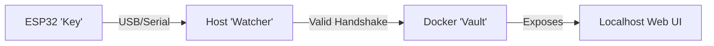

# Project Aegis 🛡️

**A Hardware-Backed, Air-Gapped Credential Vault**

Project Aegis is a high-security password management system that bridges the physical and digital worlds. It uses an **ESP32 microcontroller** as a physical security token ("The Key") to cryptographically unlock a secure, containerized environment ("The Vault") on your host computer.

Unlike traditional password managers that rely solely on a master password, Aegis requires **physical possession** of the programmed device to access your data. When the key is unplugged, the vault vanishes.

## 🏗️ Architecture

The system consists of three distinct components:

1.  **The Key (Firmware):** An ESP32 device that holds a unique **Secret Key** (never revealed via USB) and performs HMAC-SHA256 signing.
2.  **The Gatekeeper (Host):** A Python daemon running on your PC that monitors USB ports, challenges the Key, and manages the Vault.
3.  **The Vault (Container):** A secure Docker container hosting a local web interface for password management, which is only running when the Key is authenticated.



## 🚀 Getting Started

### Prerequisites

*   **Hardware:** An ESP32 Development Board (e.g., DOIT ESP32 DEVKIT V1).
*   **Software:**
    *   [PlatformIO](https://platformio.org/) (VS Code Extension recommended) for flashing firmware.
    *   Python 3.x
    *   Docker Desktop

### 1. Firmware Setup ("The Key")

1.  Navigate to the `firmware` directory:
    ```bash
    cd firmware
    ```
2.  **Important:** Configure your Secret Key.
    *   Open `src/secrets.h`.
    *   Change the `SECRET_KEY` variable to a long, random string.
    *   *Note: This file should ideally be excluded from version control in a real deployment.*
3.  Connect your ESP32 via USB.
4.  Upload the firmware:
    ```bash
    pio run --target upload
    ```

### 2. Host Setup ("The Gatekeeper")

1.  Navigate to the `host` directory:
    ```bash
    cd host
    ```
2.  Install dependencies:
    ```bash
    pip install -r requirements.txt
    ```
3.  **Important:** Configure the Host Key.
    *   Open `test_esp32.py` (or the main watcher script).
    *   Ensure `SHARED_SECRET_KEY` matches the key you put in `firmware/src/secrets.h` **exactly**.

## 🧪 Testing

To verify that your ESP32 is correctly signing challenges:

1.  Plug in your ESP32.
2.  Run the test script:
    ```bash
    python3 host/test_esp32.py
    ```
3.  You should see a message: `>>> SUCCESS: ESP32 signature matches! Handshake Verified. <<<`

## 🔒 Security Model

*   **Challenge-Response Auth:** The Host sends a random "nonce" to the ESP32. The ESP32 signs it with its internal secret and returns the signature. The Secret Key never travels over the wire.
*   **Anti-Replay:** Since every challenge is random, recording the USB traffic is useless to an attacker.
*   **Physical Segregation:** Passwords are stored on the Host (encrypted), but the Authorization logic is on the Device. Both are required to unlock the vault.

## 🗺️ Roadmap

- [x] **Phase 1:** Firmware HMAC-SHA256 Implementation
- [x] **Phase 2:** Basic Host-Device Handshake Verification
- [ ] **Phase 3:** Host "Watcher" Service (Auto-start Docker)
- [ ] **Phase 4:** Secure Flask Web App (The Vault)
- [ ] **Phase 5:** Database Encryption (AES-256)

## 📄 License

[MIT License](LICENSE)
