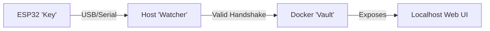
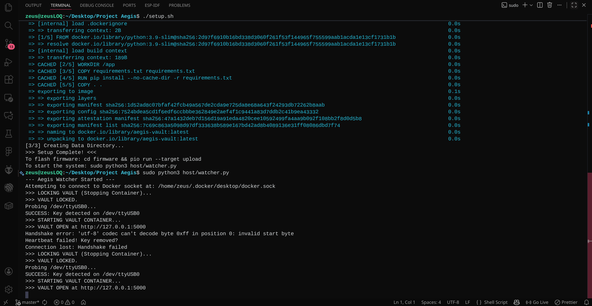

# Project Aegis 🛡️

**A Hardware-Backed, Air-Gapped Credential Vault**


*The Aegis Vault Dashboard: A modern, secure interface accessible only when your hardware key is plugged in.*

---

**Project Aegis** is a high-security password management system that bridges the physical and digital worlds. It uses an **ESP32 microcontroller** as a physical security token ("The Key") to cryptographically unlock a secure, containerized environment ("The Vault") on your host computer.

Unlike traditional password managers that rely solely on a master password, Aegis requires **physical possession** of the programmed device to access your data. When the key is unplugged, the vault vanishes.

## 📸 Hardware In Action

| **Secured (Locked)** | **Unlocked (Connected)** |
|:---:|:---:|
|  |  |
| *Without the key, the vault remains inaccessible and encrypted.* | *Plug in the ESP32 to instantly decrypt and launch the Vault.* |

## 🏗️ Architecture

The system consists of three distinct components:

1.  **The Key (Firmware):** An ESP32 device that holds a unique **Secret Key** (never revealed via USB) and performs HMAC-SHA256 signing.
2.  **The Gatekeeper (Host):** A Python daemon running on your PC that monitors USB ports, challenges the Key, and manages the Vault.
3.  **The Vault (Container):** A secure Docker container hosting a local web interface for password management, which is only running when the Key is authenticated.



## 🚀 Getting Started

### Prerequisites

*   **Hardware:** An ESP32 Development Board (e.g., DOIT ESP32 DEVKIT V1).
*   **Software:**
    *   [PlatformIO](https://platformio.org/) (VS Code Extension recommended) for flashing firmware.
    *   Python 3.x
    *   Docker Desktop

### 1. Firmware Setup ("The Key")

Since this repository protects your security, the file containing the secret key is **ignored** by Git. You must create it manually.

1.  Navigate to the `firmware` directory:
    ```bash
    cd firmware
    ```
2.  **Create the Secrets File:**
    *   Create a new file named `src/secrets.h`.
    *   Paste the following code into it:
        ```cpp
        #pragma once
        // Replace the string below with your own unique secret key.
        // You must use this EXACT key in your host/watcher.py file.
        const char* SECRET_KEY = "CHANGE_THIS_TO_YOUR_RANDOM_SECRET_KEY";
        ```
3.  Connect your ESP32 via USB.
4.  Upload the firmware:
    ```bash
    pio run --target upload
    ```

### 2. Host Setup ("The Gatekeeper")

1.  Run the automated setup script (installs dependencies & builds Docker image):
    ```bash
    ./setup.sh
    ```
2.  **Configure the Host Key:**
    *   Open `host/watcher.py`.
    *   Locate the `SHARED_SECRET_KEY` variable at the top of the file.
    *   **Crucial:** Update it to match the *exact same string* you put in `firmware/src/secrets.h`.
    ```python
    # host/watcher.py
    SHARED_SECRET_KEY = "CHANGE_THIS_TO_YOUR_RANDOM_SECRET_KEY".encode('utf-8')
    ```

### 3. Running the System

1.  Plug in your ESP32 "Key".
2.  Start the Watcher Daemon:
    ```bash
    sudo python3 host/watcher.py
    ```
3.  The Watcher will detect the key, perform the handshake, and automatically start the Vault.
4.  Open your browser to `http://127.0.0.1:5000` to access your credentials.
5.  **Locking:** Simply unplug the ESP32. The container will stop immediately.


*Real-time CLI logs showing the authentication handshake and Docker container management.*

## 🛡️ Active Protection

The system implements a continuous **Heartbeat Mechanism**. The web interface polls the server every second to ensure the secure channel is active.

**Auto-Lock Trigger:**
If you **unplug the ESP32** or **stop the watcher script**, the Vault container is killed immediately. The web interface detects this loss of connection and instantly locks the screen with a blurred overlay, preventing any further viewing or editing of credentials.


*The interface automatically locks and blurs when the hardware key is removed.*

## 🧪 Testing

To verify that your ESP32 is correctly signing challenges (without running the full system):

1.  Plug in your ESP32.
2.  Run the test script:
    ```bash
    python3 host/test_esp32.py
    ```
3.  You should see a message: `>>> SUCCESS: ESP32 signature matches! Handshake Verified. <<<`

## 🔒 Security Model

*   **Challenge-Response Auth:** The Host sends a random "nonce" to the ESP32. The ESP32 signs it with its internal secret and returns the signature. The Secret Key never travels over the wire.
*   **Anti-Replay:** Since every challenge is random, recording the USB traffic is useless to an attacker.
*   **Physical Segregation:** Passwords are stored on the Host (encrypted), but the Authorization logic is on the Device. Both are required to unlock the vault.

## 🗺️ Roadmap

- [x] **Phase 1:** Firmware HMAC-SHA256 Implementation
- [x] **Phase 2:** Basic Host-Device Handshake Verification
- [x] **Phase 3:** Host "Watcher" Service (Auto-start Docker)
- [x] **Phase 4:** Secure Flask Web App (The Vault)
- [x] **Phase 5:** Database Encryption (AES-256)
