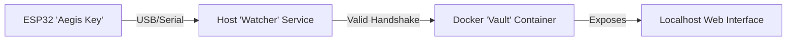

# Project Aegis: The Hardware-Backed Credential Vault

## 1. Project Overview
**Project Aegis** is a high-security, hardware-authenticated credential management system. It uses an ESP32 microcontroller as a physical security token ("The Key") to unlock a secure, containerized environment ("The Vault") on a host computer.

Unlike traditional password managers that rely solely on software master passwords, Aegis requires physical possession of the programmed ESP32 device to access the data.

### 1.1 Core Philosophy
*   **Physicality:** Digital access requires a physical handshake.
*   **Segregation:** Secrets are stored on the powerful host, not the constrained device.
*   **Ephemeral Access:** The vault is only accessible when the key is present (optional extension).

## 2. Architecture

The system consists of three distinct components interacting sequentially:



### Component A: The Aegis Key (ESP32 Firmware)
*   **Role:** Authentication Token.
*   **Implementation:** ESP-IDF (C).
*   **Logic:**
    1.  Initializes USB/UART interface.
    2.  Waits for a "Challenge" string from the host.
    3.  Computes an HMAC-SHA256 signature of the challenge using a stored internal Secret Key.
    4.  Returns the signature.
    *   *Note:* The Secret Key never leaves the device.

### Component B: The Watcher (Host Daemon)
*   **Role:** Gatekeeper.
*   **Implementation:** Python script (Systemd Service).
*   **Logic:**
    1.  Monitors USB ports for device insertion.
    2.  Detects the ESP32.
    3.  Generates a random cryptographic nonce (Challenge).
    4.  Sends Challenge to ESP32.
    5.  Verifies the returned Signature against the expected value.
    6.  **Success:** Triggers `docker start aegis-vault`.
    7.  **Failure:** Logs intrusion attempt; ensures Docker is stopped.

### Component C: The Vault (Docker Container)
*   **Role:** Secure Storage & Interface.
*   **Implementation:** Python (Flask) + SQLite (AES-256 Encrypted).
*   **Features:**
    *   **Web UI:** Clean, responsive interface running on `http://127.0.0.1:5000`.
    *   **Encryption:** Database rows are encrypted; the "Master Password" for the DB is injected by the Watcher only upon successful handshake.
    *   **Operations:** CRUD (Create, Read, Update, Delete) for credentials.

## 3. Security Analysis

| Threat Vector | Mitigation |
| :--- | :--- |
| **Stolen ESP32** | The device contains only the signing key, not the actual user passwords. Without the specific Host PC (which holds the encrypted Docker volume), the Key is useless. |
| **Stolen PC** | The Docker volume is encrypted. Without the ESP32 Key to authorize the "Watcher" to unlock it, the container will not start/decrypt. |
| **Network Snooping** | The Web UI binds strictly to `127.0.0.1`. It is not accessible from the local network (WiFi), only from the machine itself. |
| **Replay Attacks** | The Watcher generates a unique random "Challenge" for every handshake. Recording an old valid response will not work for a new challenge. |

## 4. Operational Workflow

1.  **Plug In:** User connects ESP32 to USB port.
2.  **Auto-Unlock:**
    *   Watcher detects device.
    *   Handshake passes.
    *   Docker container spins up.
    *   Browser automatically opens to `http://127.0.0.1:5000`.
3.  **Manage:** User views/edits passwords via the Web UI.
4.  **Lock:** User disconnects ESP32. Watcher detects removal and stops the Docker container (locking the vault).

## 5. Development Roadmap

### Phase 1: Firmware (The Key)
*   Setup ESP-IDF project `aegis-key`.
*   Implement HMAC-SHA256 signing logic using mbedTLS.
*   Implement Serial Command-Response loop.

### Phase 2: Host Watcher (The Gatekeeper)
*   Write Python script using `pyserial`.
*   Implement Challenge-Response verification.
*   Add Docker control logic (`docker-py`).

### Phase 3: The Vault (Web App)
*   Build simple Flask application.
*   Create SQLite schema.
*   Implement AES encryption for database fields.
*   Dockerize the application.

## 6. Directory Structure
```text
/home/zeus/code/aegis/
├── firmware/           # ESP32 Code
│   ├── main/
│   │   ├── main.c
│   │   └── CMakeLists.txt
│   └── CMakeLists.txt
├── host/               # PC-Side Code
│   ├── watcher.py      # The Daemon
│   └── requirements.txt
└── vault/              # Docker Web App
    ├── app.py
    ├── Dockerfile
    ├── templates/
    └── static/
```
